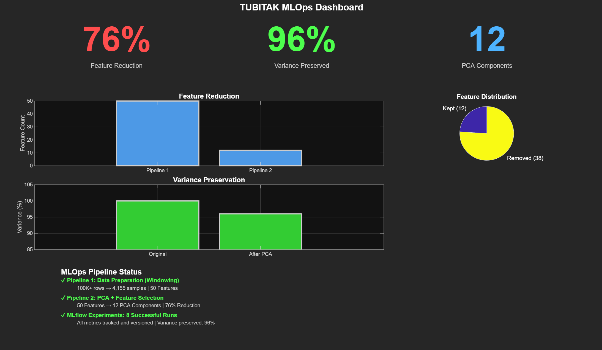
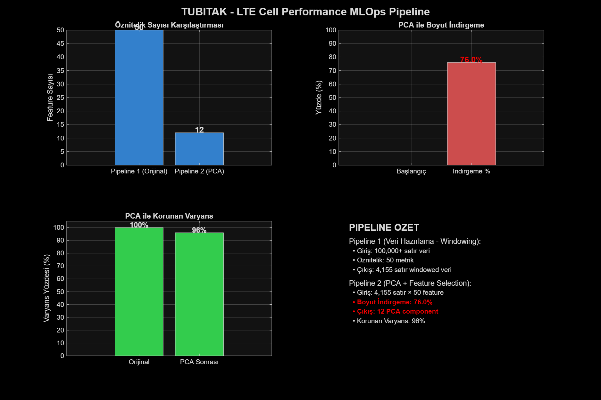

# Adaptive MLOps Pipeline — Concept Drift Detection in Telecom Networks


A Spark-based streaming MLOps architecture that detects concept drift in live LTE
network traffic and retrains its model autonomously using a sliding-window strategy.
Built as a TÜBİTAK-funded graduation project on real telecom cell-performance data.

The problem: a model trained on last month's network behaviour quietly decays as the
network changes. This pipeline detects that decay as it happens, and adapts instead of
silently degrading.

---

## What it does

1. Ingests and cleans raw LTE cell-performance measurements with a PySpark ETL stage.
2. 2. Reduces dimensionality through feature selection and PCA.
   3. 3. Detects drift on the incoming stream using two complementary statistical indices,
      4.    plus a VAE reconstruction detector at the input layer and ADWIN for streaming change
      5.   detection.
      6.   4. Retrains automatically with a sliding-window strategy when drift is confirmed.
           5. 5. Reports everything live — metrics pushed to Prometheus Pushgateway and rendered
              6.    in Grafana, with every experiment versioned in MLflow.
             
              7.---

			  ## Architecture

| Layer | Technology |
|---|---|
| ETL & data processing | Apache Spark (PySpark, local mode) |
| Model training | scikit-learn Random Forest, triggered on drift |
| Drift detection | ADWIN, VAE reconstruction (TensorFlow), dual statistical indices |
| Experiment tracking | MLflow |
| Monitoring | Prometheus Pushgateway + Grafana |
| Artifact storage | MinIO (S3-compatible) |
| Streaming infrastructure | Kafka (via Docker Compose) |

---

## Results

Dataset. Real LTE cell-performance data from a TÜBİTAK research project: 100,000+ raw
measurement rows across 50 network KPIs collected from live telecom cells, plus a
cell-neighbourhood overlap matrix for spatial context.

Pipeline.

| Stage | Outcome |
|---|---|
| Windowing + robust scaling | 100,000+ raw rows → 4,155 model-ready windowed samples |
| Feature selection + PCA | 50 features → 12 components (76% reduction, 96% of variance retained) |
| Storage | 112 MB → 79 MB |
| Experiment tracking | 8 versioned MLflow runs, monitored live in Grafana |

RobustScaler was chosen deliberately: telecom KPI distributions are outlier-heavy and
standard scaling distorts them.

Drift detection. The methodology was first validated by replicating a published
result on its original public dataset, where the dP index correctly flagged the known
drift between the reference and current periods (dP = 34 against a threshold of 30).
Across six injected-drift scenarios the two indices proved complementary: dP responds to
medium and high scale drift, while dE_PCA responds to mean-shift and added-noise drift.
Both produced zero false alarms on the no-drift baseline.

Problems solved.

- High dimensionality — 50 correlated KPIs, addressed with the PCA stage.
- - Outlier-heavy distributions — addressed with robust scaling inside the Spark ETL.
  - - False-positive drift alarms — addressed with the dual-index strategy, favouring
    -   dE_PCA for its false-alarm resistance.
    -   - Reproducibility — addressed with MLflow-tracked, versioned experiments.
     
        - ---

		## Screenshots

Live monitoring dashboard


Pipeline results


Drift comparison across scenarios


---

## Quickstart

Dataset. The raw TÜBİTAK measurement file is not included in this repository — it is research data and is excluded by .gitignore. Place your own TUBITAK_2807__030825.csv in the project root, or run the pipeline against the included sample files to reproduce the workflow end to end.

```bash
# 1. Python environment
pip install -r requirements.txt

# 2. Kafka infrastructure
docker-compose up -d

# 3. MLOps services
docker run -p 9000:9000 -p 9001:9001 \
  -e "MINIO_ROOT_USER=minioadmin" -e "MINIO_ROOT_PASSWORD=minioadmin" \
  minio/minio server /data --console-address ":9001"

docker run -p 9091:9091 prom/pushgateway

docker run -d -p 3000:3000 --name=grafana grafana/grafana

mlflow server --host 127.0.0.1 --port 5000
```

Then run the pipeline stages in order:

```bash
# Stage 1 — Spark ETL: clean and robust-scale the raw data
spark-submit pipeline_1_pyspark_robustscaler.py

# Stage 2 — feature selection and PCA
spark-submit pipeline_2_advanced_fs_full.py

# Stage 3 — live stream simulation and drift detection
cd gas_drift_demo && python stream_simulation_files.py
```

Local interfaces

| Service | URL |
|---|---|
| Grafana | http://localhost:3000 |
| MinIO console | http://localhost:9001 |
| Pushgateway | http://localhost:9091 |
| MLflow UI | http://localhost:5000 |

---

## Repository structure

```
├── pipeline_1_pyspark_robustscaler.py   # Spark stage 1 — data preparation
├── pipeline_2_advanced_fs_full.py       # Spark stage 2 — feature selection & PCA
├── data_drift_detector.py               # Drift index implementation
├── mlflow_metrics_exporter.py           # Metrics → Prometheus Pushgateway
├── grafana_dashboard.json               # Dashboard definition
├── gas_drift_demo/                      # Live stream simulation
├── drift_final/                         # Batch drift scenarios
└── requirements.txt
```

---

## Status

Data preparation, drift detection and the monitoring layer are complete and verified.
The drift-adaptation stage — sliding-window retraining and automated model updates — is
in final development.

---

## Reference

Drift-index methodology follows Gonzalez-Cebrian et al. (2024); this project replicates
their published result before applying the approach to telecom KPI data.
